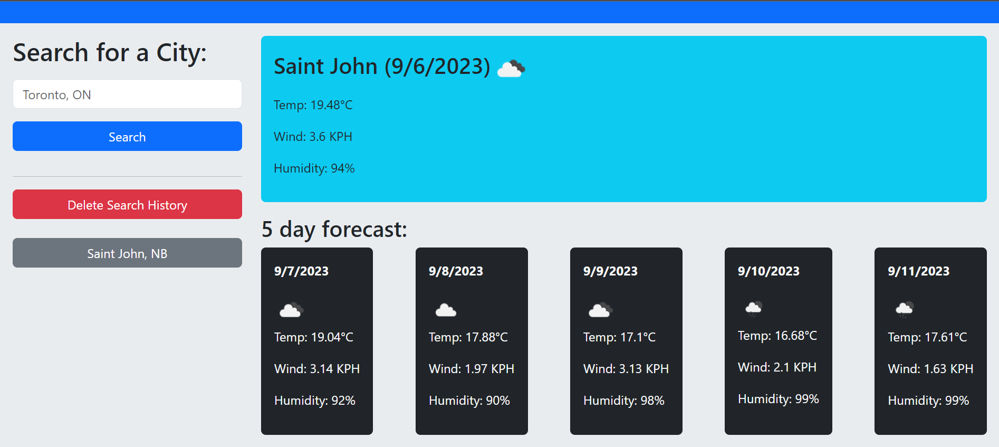

# Weather-Dashboard

## Descripton

This website is a weather dashboard that retrieves data from the [Open Weather Map API](https://openweathermap.org/).
It is set to display Canadian weather data but can be set to display weather data for different countries.

Each successful search displays the current weather data and weather data for 5 days in the future.

A running search history is stored and can be deleted. The search history (when present) appears on the left in the form of clickable buttons that will show the associated weather data when clicked.

## Usage

## URL

[Link to live website.](https://bhansi.github.io/Weather-Dashboard/)